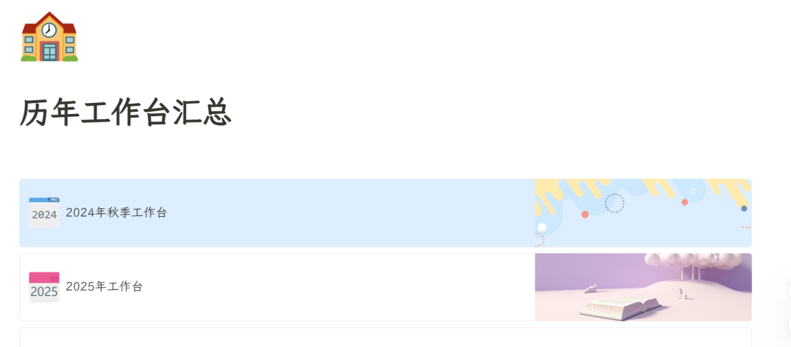
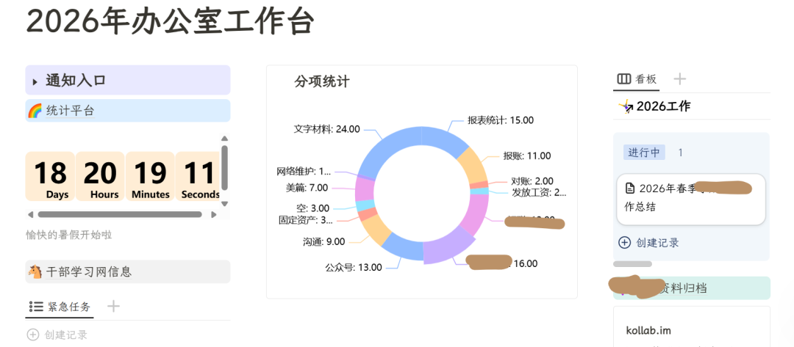
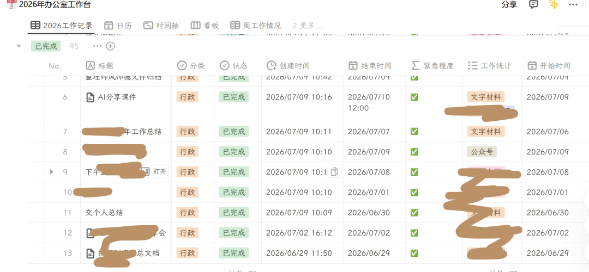
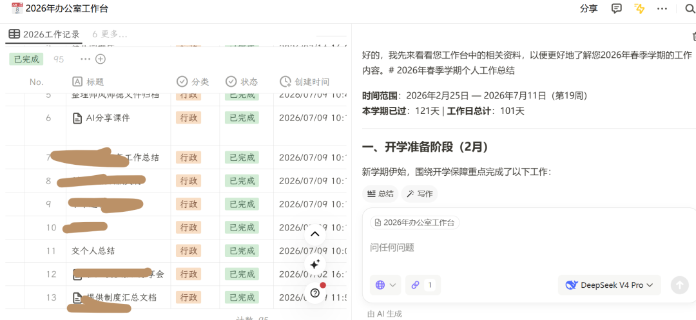
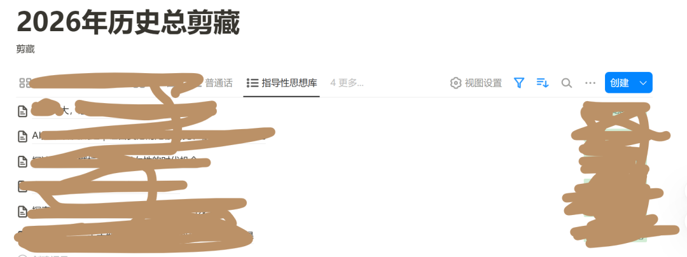
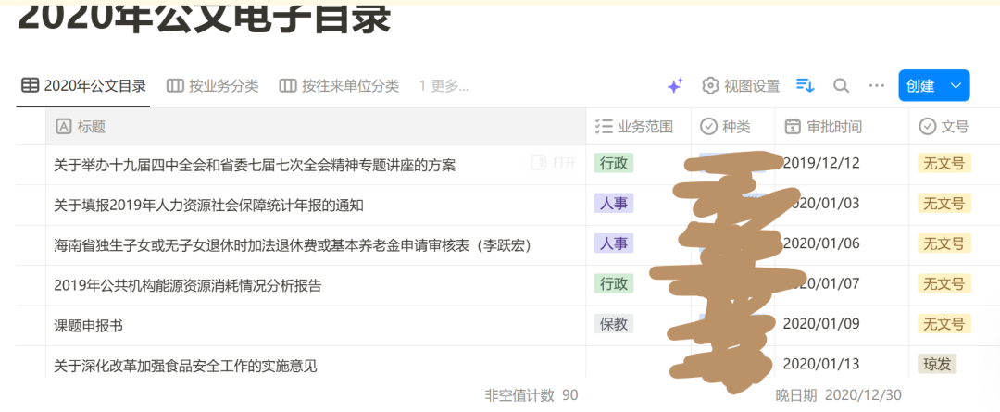
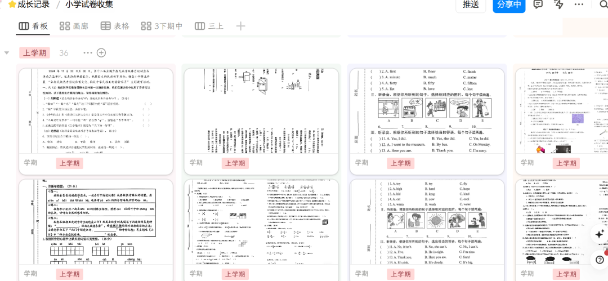
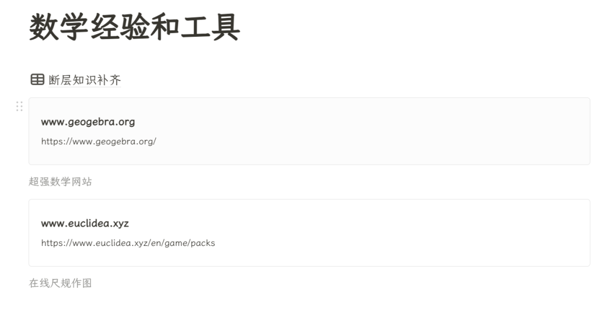
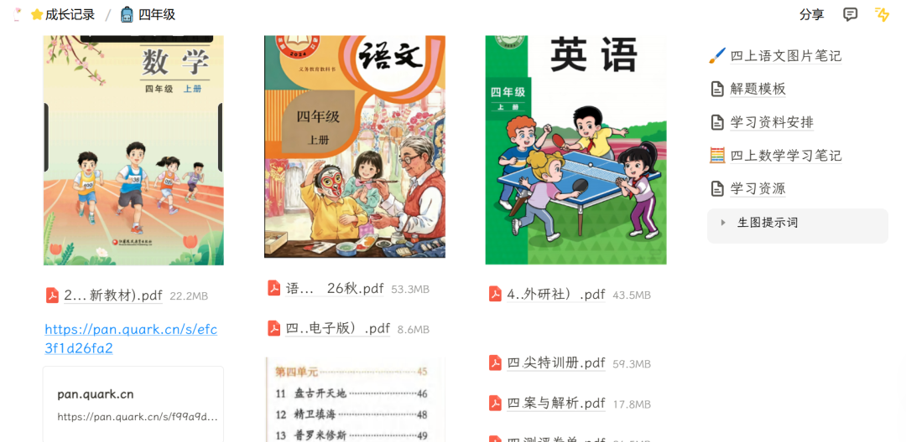

# 什么是真正的工作台

> 作者: 月半宵夜趣 | 平台: 微信公众号 | 日期: 2026-08-08 11:26 | 原文: https://mp.weixin.qq.com/s/CRhHKjAr7AUosnQ1Hvh_EQ

> **摘要**: 工作台不该是增加负担的打卡工具，而应融入日常工作流，自动沉淀真实数据，成为集学习、笔记、素材采集和 AI 交互于一体的综合数据库。

> 工作台不该是增加负担的打卡工具，而应融入日常工作流，自动沉淀真实数据，最终成为集学习、笔记、素材采集和 AI 交互于一体的综合数据库。

我一直觉得，工作台的核心在于三个要点。

## 第一，不能反人性

要能够给人带来方便和服务，而不是一个华丽的任务发布中心。要让人使用起来觉得这个东西是在帮我减少工作量，而不是在给我带来新的工作量。

特别是，我个人很反对需要人为打卡这种东西，因为打卡就相当于增加了一个新的工作任务。真正的打卡应该是例如 GitHub 那种热力图——它不需要你去单独专门的人为操作，只有你切实地做了工作，比如维护代码、新增项目，监听到切实的工作动态，它才会自动生成新的热力数据，这才叫有效的工作数据统计。

## 第二，不能舍本逐末

不能舍本逐末地追求统计仪表数字，而忽视背后我们能真正坚持下来的学习和良好的习惯。我敢打赌，大多人手搓了漂亮的工作台以后大都是一阵风，最后没有几个工作台真正可以起到作用。

我自己使用工作台已经 3 年了，但是和大家现在在 AI 中建立的工作台不一样——我的工作台是真正有我的日常数据在里面的：

这是我 26 年的工作台：

真正的工作台核心一定是真实的工作入口，而不是脱离实际的工作和学习，去搞一堆虚头巴脑的打卡。

由于我的工作是可以直接在多维表完成的，我是直接在工作台工作，无需完成打卡。因为只要发生工作痕迹，工作台会自动为我记录、为我整理数据。然后到了学期末或者年底的时候，我可以召唤 AI 一键为我写工作总结：

学校或者主管机关的公众号是可以采集到数据库的，可以在年底形成总结汇报：

以及单位 WIKI，例如依法依规公开文件素材库：

这样我们的日常工作和 WIKI 连通起来，同时把行业公众号联合利用起来，成为了一个真正的丰富的材料库。因此我写材料从来不愁没有素材可写，反而是太多了，需要 AI 整理才能看得过来。

## 第三，不要局限工作台的作用

很多人认为工作台就是一个打卡网页，这是错误的认识。工作台实际上是一个数据库——可以是学习数据库、可以是笔记沉淀、可以是网络素材采集，也可以是 AI 交互中心。

也可以用来给孩子学习：

也可以是工具箱：

工作台不该是增加负担的打卡工具，而应融入日常工作流，自动沉淀真实数据，最终成为集学习、笔记、素材采集和 AI 交互于一体的综合数据库。就你这个里面一定要有真的东西，光是打勾打叉那是糊弄鬼，不要去用AI去糊弄自己，让自己看起来好像很努力很厉害，没用的。
