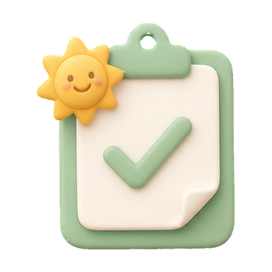

# 识字专区视觉与交互优化方案（v2）

> 建档：2026-08-16  
> 目标：把已有的识字量测评、错字本、成长档案和课时入口，整理成一套更清楚、更有亲和力、可持续扩展的儿童学习界面。  
> 参考：`DS--认字参考方案.md` 的页面信息架构与视觉节奏；原始需求笔记 `G:\UserCode\跨平台采集器\notes\游戏设计\学习游戏机制\给儿子写的识字App，审核第9天才过\给儿子写的识字App，审核第9天才过.md`。  
> 关联执行包：`docs/plans/T20260816-literacy-uplift/`

## 0. 结论先说

识字部分采用“奶油底 + 雾绿主色 + 蜂蜜黄激励 + 蓝色档案”的柔光卡片语言。参考图中最值得保留的是：

1. 首页先给家长一个识字量 KPI，再给孩子三个一眼能懂的入口。
2. 测评页只保留“进度、一个大字、四个选项、确认”这条主路径，不用计时器制造压力。
3. 错字本以字卡网格呈现，把“错了几次”变成可以行动的复习线索。
4. 档案页把最近、最高、本月新增和成长曲线放在同一个视野内。

本方案只借鉴信息架构、留白、卡片层级和配色关系，不复制参考 App 的名称、吉祥物、商标、文案或 App Store 元素。页面文字由 HTML/CSS 渲染，图片只提供原创的无文字插画与图标，避免文字失真、无法翻译和无障碍不可读。

## 1. 视觉基线

### 1.1 色彩 token

| Token | 色值 | 用途 |
| --- | --- | --- |
| `--literacy-canvas` | `#FFFDF6` | 页面底色，接近纸张但不发灰 |
| `--literacy-surface` | `#FFFFFF` | 主卡片与字卡底 |
| `--literacy-ink` | `#26352B` | 标题、汉字、正文 |
| `--literacy-green` | `#55B947` | 主按钮、正确反馈、进步曲线 |
| `--literacy-green-deep` | `#277B39` | 标题、阶段名、关键数字 |
| `--literacy-honey` | `#F7C84B` | 激励、证书、测评入口 |
| `--literacy-sky` | `#72B2F2` | 档案、成长、次级信息 |
| `--literacy-coral` | `#F29A62` | 错字次数徽标，仅用于提示，不做惩罚色 |
| `--literacy-line` | `#E9E5D8` | 分隔线、田字格、打印裁切线 |

### 1.2 形态与层级

- 页面边距：桌面/平板 `32–56px`，390px 手机宽度 `16px`；卡片间距 `16–24px`。
- 大卡圆角 `28px`，小卡圆角 `20px`，按钮圆角 `999px`；不使用尖锐的矩形弹窗。
- 卡片使用 `1px` 低对比边框 + 很轻的下投影；不使用发光、玻璃拟态或高饱和渐变。
- 重要数字使用深绿，增量使用蜂蜜黄或橙色；不要让所有内容都抢主色。
- 单个触控热区至少 `44×44px`，孩子端主要按钮目标 `52px` 以上。
- 动效只承担“当前发生了什么”：完成、翻页、展开；不使用持续飘动或自动播放装饰。

### 1.3 插画约束

- 统一使用柔和的 2.5D 纸黏土/软质插画感，边缘干净、阴影贴近主体。
- 主视觉使用原创“向阳小种子/阅读小伙伴”方向，不使用毛毛虫或参考 App 的角色形象。
- 素材必须无文字、无字母、无数字、无伪汉字、无 logo、无水印；中文内容全部叠加在 DOM 层。
- 透明素材生成阶段使用纯 `#00FF00` 去背底，最终交付必须是 RGBA PNG；主体内不得出现去背绿。
- 复杂背景、证书底纹等非透明素材也保持留白，避免把 UI 文案烘焙进图片。

## 2. 页面结构与交互

### 2.1 识字今日页：先看成长，再开始学习

```text
顶部标题/家长入口
        ↓
KPI 行：最近识字量 | 本周新增 | 当前阶段
        ↓
主视觉：向阳小种子 + 一句短鼓励
        ↓
三大入口卡：开始测评 | 错字本 | 成长档案
        ↓
周连续条：已完成天数 + 下一个小奖励
        ↓
今日课时列表（原入口保留）
```

设计要点：

- KPI 行只显示 3 个指标，不堆叠“正确率、时长、积分”等家长次要信息。
- 三大卡各自使用独立色相：测评雾绿、错字蜂蜜、档案天空蓝；卡面插画只占右上/右侧，不压住标题和点击区域。
- 周连续条是轻激励，不展示排名、不显示失败、不扣分；没有学习记录时显示“今天先认识一个字”。
- 原有课时列表仍在三大卡下方，避免视觉改版导致既有学习路径丢失。

### 2.2 识字量测评：孩子只需要点选

- 顶部：返回、`第 N/25 题`、线性进度条；不显示倒计时和“快一点”。
- 中部：一张大字卡，汉字字号随 viewport 缩放但不小于 `72px`；朗读按钮独立于字卡点击区。
- 下部：2×2 拼音选项；选项文本使用真实 DOM，支持正确/已选/待确认/错误后的明确状态。
- 确认按钮在四选项下方保持固定位置，避免选项变化导致误触。
- 答错时只说“我们再认识一次”，展示正确读音并进入错字本；不扣阳光、不播放刺耳音效。
- 完成后结果页只展示估算识字量、置信度、阶段、错字数和下一步按钮；低置信度使用“参考值”措辞。

### 2.3 错字本：从列表变成复习工作台

- 顶部：错字总数、排序规则、返回；默认按错次倒序。
- 中部：识字错题使用 2 列（手机）/4 列（平板）的字卡网格；每张卡包含大字、拼音、儿童词、错 N 次徽标和田字格。
- 底部固定操作：`专项复习`（主按钮）与 `打印字卡`（次按钮）。
- 专项复习只读 `subject=识字` 的错题队列；同一字连续答对 3 次后进入既有 mastered 通道。
- 非识字科目的错题继续沿用原列表和行为，不能因为统一视觉而改变其他科目。

### 2.4 成长档案：数字、曲线、行动建议同屏

- 顶部 KPI：最高识字量、最近识字量、本月新增；空状态只给“先完成一次测评”。
- 主图：SVG 折线，阶段参考线为 250/500/750；参考线轻、数据线清楚，纵轴不制造“排名”感。
- 左侧/上方阶段卡：阶段名 + 一句“下一步建议”，不显示比较他人的百分位。
- 证书入口只对有效测评开放；低置信度记录可以进入历史，但不能生成成就证书或刷新最高纪录。

### 2.5 打印字卡：屏幕看得舒服，纸上也能练

- A4 纵向、2×4 共 8 张；卡片间用虚线裁切，不依赖背景图片才能成立。
- 每张卡固定包含：大字田字格、拼音、一个儿童词、音频提示图标位、至少 5 个练写格。
- 打印样式隐藏导航、按钮和屏幕装饰，只保留黑/深绿文字、浅色格线和少量装饰。
- `window.print()` 即可导出，不增加 PDF/截图依赖，不发网络请求。

## 3. 素材清单与生成规格

第一批只生成能直接帮助页面变好看的“低风险素材”，不生成整张带中文文案的 UI 截图。

| ID | 用途 | 形式/尺寸 | 透明 | 挂点 |
| --- | --- | --- | --- | --- |
| `literacy-companion-reading` | 今日页主视觉、结果页鼓励 | PNG，512×512 | 是 | `data-asset="companion-reading"` |
| `literacy-action-assess` | 开始测评卡 | PNG，384×384 | 是 | `data-asset="action-assess"` |
| `literacy-action-mistakes` | 错字本卡 | PNG，384×384 | 是 | `data-asset="action-mistakes"` |
| `literacy-action-profile` | 成长档案卡 | PNG，384×384 | 是 | `data-asset="action-profile"` |
| `literacy-badge-seed` | 0–250 阶段徽章 | PNG，256×256 | 是 | `data-stage="seed"` |
| `literacy-badge-story` | 250–500 阶段徽章 | PNG，256×256 | 是 | `data-stage="story"` |
| `literacy-badge-reading` | 500–750 阶段徽章 | PNG，256×256 | 是 | `data-stage="reading"` |
| `literacy-badge-fluent` | 750+ 阶段徽章 | PNG，256×256 | 是 | `data-stage="fluent"` |
| `literacy-certificate-corner` | 证书角花/奖章装饰 | PNG，512×512 | 是 | 打印页角部，可选 |

生成与验收规则：

1. 以 `gpt-image-2` 生成纯色去背底版本；响应先按真实文件签名判断 PNG/JPEG，再处理。
2. 去背后检查 alpha 通道、四角透明、主体边缘无绿边、尺寸符合清单；任何一项失败不进入 published 目录。
3. 生成原图、去背图和语义 manifest 留在方案素材目录；通过视觉审核的文件再复制到 `prj/assets/generated/preschool-literacy-uplift/published/`。
4. 不把图片直接塞进 `character-bank.json`；字库内容和插画资源保持可独立替换。

### 3.1 统一生图提示词前缀

```text
原创儿童学习应用插画，soft claymorphism，奶油白、雾绿、蜂蜜黄、天空蓝的低饱和配色，柔和自然光，干净圆润边缘，主体完整，四周留安全边距。纯色 #00ff00 chroma-key 背景，主体以外没有阴影、纹理、地面、渐变或反光。主体内部不要出现 #00ff00。无文字、无字母、无数字、无伪汉字、无 logo、无水印，不模仿任何现有品牌或角色。
```

### 3.2 分素材提示词

| 资产 | 追加描述 |
| --- | --- |
| companion | 一个原创的圆润向阳小种子伙伴，头顶两片小叶子，怀抱打开的黄色绘本，表情专注又开心，适合页面左侧主视觉；不要昆虫身体、不要触角、不要文字。 |
| assess | 一张绿色夹板与白色勾选纸张的软质立体图标，旁边有一颗小太阳星；主体居中，适合测评入口卡。 |
| mistakes | 一本橙黄色练习本、一支铅笔和一张空白字卡叠放的软质立体图标；卡片留白，不要写任何字。 |
| profile | 一个蓝色文件夹、向上生长的三片叶子和一条小曲线组成的软质立体图标；不要数字和坐标文字。 |
| badges | 四个独立的圆形学习徽章，分别表达种子、绘本、阅读、流畅阅读；用叶片、书本、窗户等抽象符号表达，不含字母和文字。 |
| certificate | 一组绿色叶片和蜂蜜色星星组成的角部装饰，细节克制，中心区域完全留空，适合 A4 证书底纹。 |

### 3.3 当前素材预览

以下是已生成、去背并标准化后的方案素材；中文标题、按钮和拼音仍由页面层叠加：





## 4. 工程落点

### 4.1 现有文件的调整关系

| 文件 | 本轮决策 |
| --- | --- |
| `prj/app.js` | 保留现有测评/错题/档案行为；下一切片只替换视觉挂点和空状态文案，不复制图片内文案。 |
| `prj/css/preschool/40-literacy-uplift.css` | 新增 token、首页三大卡、字卡网格、阶段徽章和素材尺寸规则；移动端先于桌面端验收。 |
| `prj/preschool-literacy.js` | 不因视觉调整改测评算法；资产缺失时必须回退到文字/emoji，不阻塞玩法。 |
| `prj/assets/generated/preschool-literacy-uplift/` | 只放审核通过的项目原创素材和 manifest；草稿放 docs，不混入运行时。 |
| `docs/plans/T20260816-literacy-uplift/` | 追加视觉升级切片 V1–V3、素材验收记录和后续实现顺序。 |

### 4.2 不变的产品红线

- 不新增 localStorage key；继续使用 `courseProgress.literacy.assessments` 扩字段。
- 不引入图表库、PDF 库、字体库或运行时网络请求。
- 不使用参考 App 的名称、角色、商标、商店截图元素；图片只做原创风格化表达。
- 不增加计时惩罚、失败音效、排名和新的积分奖励。
- 无素材时页面仍可玩、可打印、可读；视觉资产不是功能依赖。

## 5. 验收清单

### 文档与设计

- [ ] 390px 手机宽度下首页不横向溢出，三大卡标题和点击区完整。
- [ ] 平板/桌面宽度下 KPI、主视觉、三大卡和课时列表有明确层级。
- [ ] 测评页没有倒计时或催促文案，错误反馈无惩罚。
- [ ] 错字卡至少展示大字、拼音、儿童词、错次、田字格。
- [ ] 档案页 0/1/N 条历史均有稳定空态/单点/折线表现。

### 素材

- [ ] 第一批素材均为原创、无文字、无 logo、无水印。
- [ ] PNG 为 RGBA；四角透明；边缘无明显去背色残留。
- [ ] 每张素材尺寸与 manifest 一致；文件体积适合本地静态资源。
- [ ] 资产缺失时 CSS/HTML 回退正常，运行时不请求远程资源。

### 运行与打印

- [ ] 测评→结果→错字本→专项复习→打印→档案→证书完整走通。
- [ ] A4 打印为 2×4 八卡，屏幕按钮和导航不出现在纸面。
- [ ] 既有定向测试保持全绿；视觉升级不改变测评估算、错题复习和阳光账本。

## 6. 后续顺序

1. 先生成并验收主视觉、三张入口图标和四枚阶段徽章。
2. 在 `40-literacy-uplift.css` 接入素材挂点，缺图仍保留 CSS/emoji 回退。
3. 浏览器走查四条主路径并保存手机宽度与打印预览证据。
4. 通过验收后再考虑证书角花和更多主题插画，不一次扩展整套字库配图。
