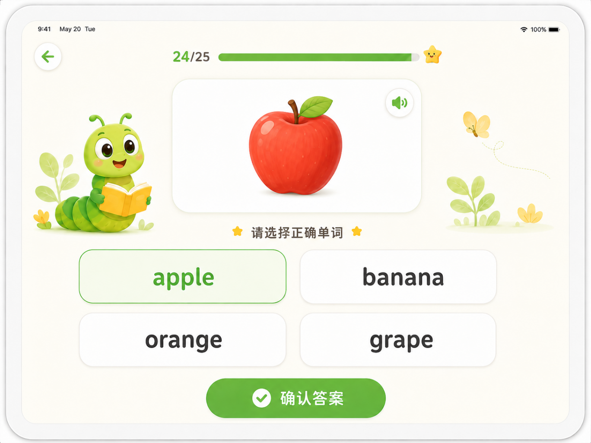
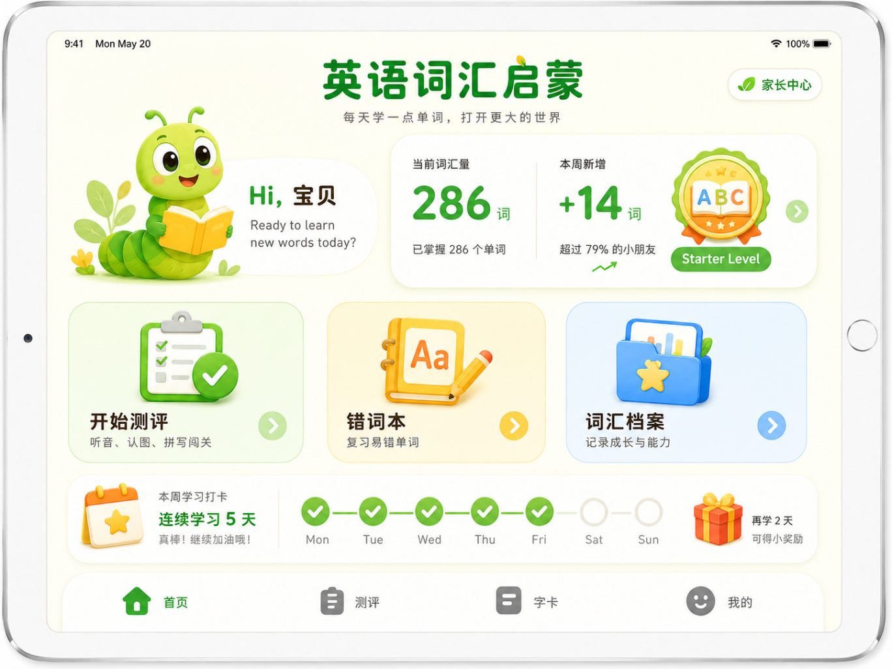
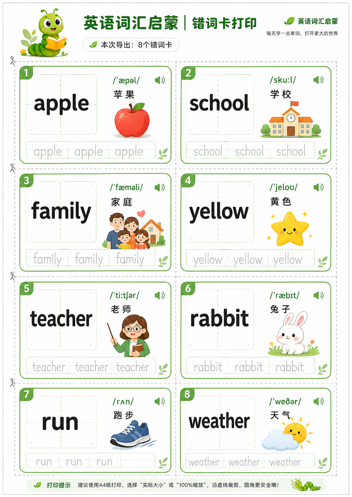
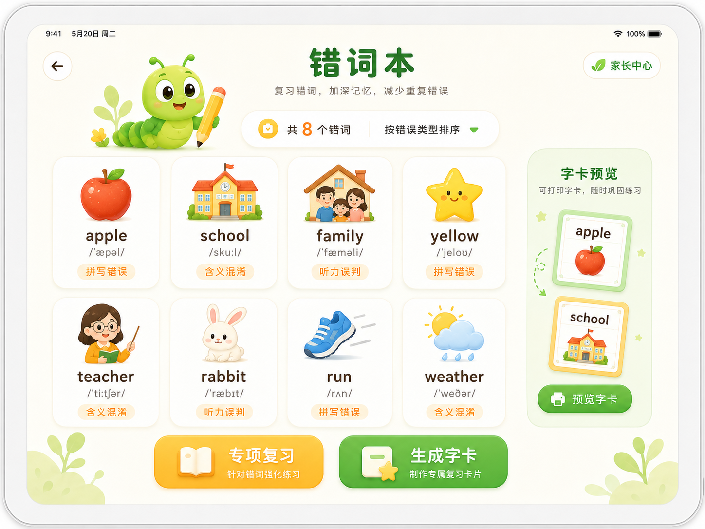
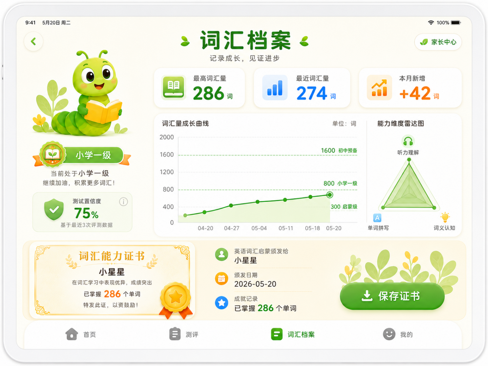

基于您之前“小书虫识字”的设计框架，我为您量身打造了一份**「英语单词学习App」的详细产品设计方案**。

这套方案完美平移了原App的**“科学测评 + 错题闭环 + 可视化成长 + 家长管控”**核心逻辑，并根据英语语言学习的特点（听、说、读、写）进行了深度适配。

---

# 「英语词汇启蒙」核心模块详细产品设计方案

## 一、 产品定位与设计理念
- **目标用户**：3-12岁（学前启蒙至小学阶段）儿童及其家长。
- **核心痛点**：市面记单词App枯燥、缺乏语境、过度游戏化导致沉迷、无法科学监测真实词汇量。
- **设计原则**：
  - **能力分层**：严格对标教育部《义务教育英语课程标准》及剑桥少儿英语（YLE）词汇量要求。
  - **四维兼顾**：结合“音（听力）、形（拼写）、义（释义）”进行综合测评。
  - **家长护城河**：严格无广告、时长可控、纯净学习环境。

---

## 二、 核心功能模块拆解与交互设计

### 模块一：词汇量智能测评（三阶测试法）
*对应原App的“翻牌字卡+拼音选择”*

考虑到英语学习不同于中文，单一的“看词选义”无法准确反映听力与拼写能力。测评设计为**“闯关式综合测试”**（根据孩子年龄段自动调整题型比例）：

- **题型A【听力选图】**（侧重音义结合）：播放单词发音（如 `/æpl/`），屏幕出现4张图片（含3个干扰项），让孩子选择对应图像。
- **题型B【看图选词】**（侧重认读）：展示一张图片（如苹果），下方提供4个英文拼写（含拼写干扰项，如 `apple`, `aple`, `appel`），让孩子选出正确拼写。
- **题型C【听音拼写】**（高阶/小学阶段）：播放单词发音，提供字母积木，让孩子按顺序拖拽组合成正确单词（通过词根/自然拼读辅助）。
- **反馈与进度**：答对即时翻牌显示星星，答错高亮正确拼写，并自动触发**“语音慢速跟读”**强化记忆。

### 模块二：错词本与艾宾浩斯强化闭环
*对应原App的“错字本+8个错字”*

- **自动收纳与分类**：
  - 将测评中答错的单词自动收录进“错词本”，并按 **“错误类型”** 分类：`拼写错误`、`含义混淆`、`听力误判`。
- **智能遗忘复习（核心算法）**：
  - 按照 **艾宾浩斯遗忘曲线**（1天、3天、7天、15天）自动推送错词进行专项强化。
  - 只有当某个单词连续3次在不同语境下（如听音、看图、拼写）全部答对，系统才将其移入“熟练词库”。
- **实体闪卡打印**：
  - 支持“一键导出错词打印包”。排版为 **“正面英文+音标 / 反面中文释义+配图”**，方便家长制作纸质闪卡，进行线下亲子互动。

### 模块三：词汇档案与可视化成长曲线
*对应原App的“识字档案、最高/最近识字量、成长曲线”*

- **数据看板（首页）**：
  - **词汇力评估**：显示 `最高词汇量` vs `最近词汇量`（例如：最高200词 / 最近185词）。
  - **能力雷达图**：用雷达图展示“听力理解”、“单词拼写”、“词义认知”三个维度的强弱项。
- **成长曲线图（核心亮点）**：
  - **双轴设计**：X轴为测试日期，Y轴为词汇量（0-2000词）。
  - **阶段划线参考**：在曲线图上自动标注出国内小学毕业基本要求（800词）、初中毕业基础（1600词）的横线，让孩子和家长直观看到**“离目标还有多远”**。
  - **趋势预测区间**：根据最近5次测试数据，生成波动区间带（浅色阴影），帮助家长预判孩子下个月的词汇量增长趋势。

### 模块四：学习小结与成就勋章体系
*对应原App的“本月成长、证书、历史记录”*

- **月度/周度成长报告**：
  - 自动生成“本月词汇成长总结”（例如：本月新增词汇 **+42个**，拼写正确率提升 **5%**）。
  - 包含：总测试次数、累计学习天数、最高连续答对记录。
- **成就勋章系统**：
  - 根据学习里程碑颁发徽章，如：“拼写小达人”（连续拼对5个）、“听力满分王”、“词汇量破百”等。
  - 每次有效测试后生成 **“词汇能力证书”**，内容包含当前词汇量、阶段（如“小学一级”）及置信度，支持家长一键保存分享。

---

## 三、 家长管控与辅助功能模块

- **纯净护盾**：严格遵守儿童应用政策，零广告、零外部商城跳转，内置“防沉迷锁”，需家长指纹/密码解锁。
- **极简时间管理**：家长可设置“每日打卡时长”（10/20/30分钟）。时间耗尽时，屏幕自动转换为“星星休息模式”，强制熄屏，保护视力。
- **自定义生词本（追加功能）**：允许家长拍摄孩子的英语课本/绘本，通过AI OCR识别并手动添加课内生词到App的测试库中，让App与学校作业完美同步。

---

## 四、 核心数据模型与分级标准（产品落地参考）

1.  **词库分级数据结构**（参考新课标与CEFR A1-A2）：
   - **启蒙级（0-300词）**：基础高频名词、动词（Apple, Cat, Run, Eat）、颜色、数字，配以卡通插画。
   - **小学一级（300-800词）**：小学3-4年级核心词汇，增加形容词、方位词、家庭、学校场景。
   - **小学二级（800-1200词）**：小学5-6年级词汇，增加自然、天气、职业、简单时态动词。
   - **初中预备（1200-1600词）**：贴近初一教材，增加抽象名词、连词、短语搭配。
2.  **置信度算法**：测试结束后，系统根据“答题正确率”、“平均答题速度”、“拼写准确度”综合计算置信度（如75%）。若置信度低于60%，系统将提示“本次测试可能存在乱点，建议明天重新测试”，确保数据对家长有真实参考价值。

---

## 五、 技术实现与交互亮点（加分项）

- **AI语音评测（进阶）**：在“听音拼写”或“跟读”环节，调用iOS原生语音识别框架，判断孩子的发音是否准确，并给出“发音很好/试试重读这个音节”等鼓励性反馈。
- **音标可视化**：在单词卡片上，无需复杂理论，用 **“颜色块”** 标注发音难点（例如，长元音用黄色高亮块标注，短元音用绿色高亮块标注），帮助孩子潜移默化建立自然拼读语感。
- **离线保底**：所有核心词库和测试逻辑置于本地，即使在无网络环境下（如飞机上、乡下），孩子依然可以完成测试和复习，数据在联网后自动同步。

---

**💡 给您的开发建议（过审与合规）**：
由于App同样面向儿童，**“语音采集”**和**“数据同步”**是审核重点。建议在首次启动时，严格遵循 **“家长授权模式”** ——明确告知家长“您的孩子在使用麦克风进行跟读训练，声音数据仅用于本地评测，不上传云端”，并在隐私政策中清晰写名，这能有效帮助您的App像“小书虫识字”一样快速（甚至更短）通过App Store审核。

如果您对其中“AI语音评测”的本地化部署，或者“拼写拖拽积木”的UI实现有具体技术困惑，我们可以进一步深入探讨！