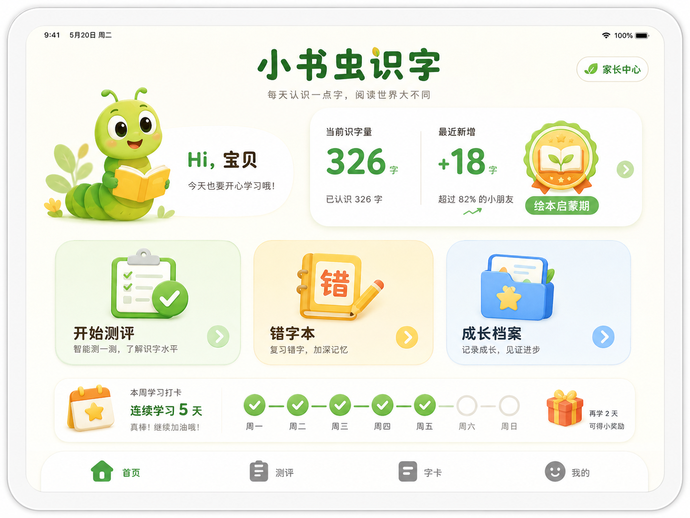
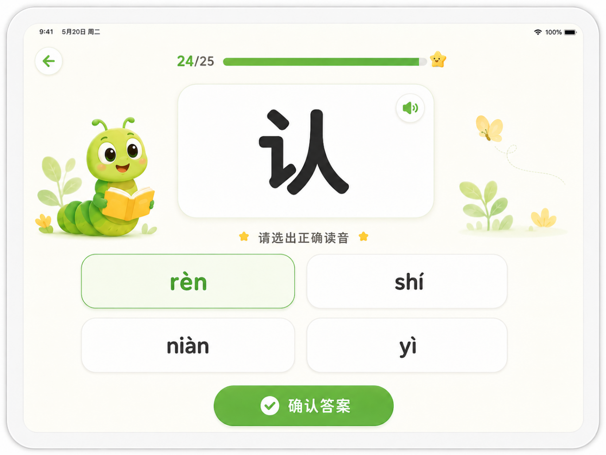
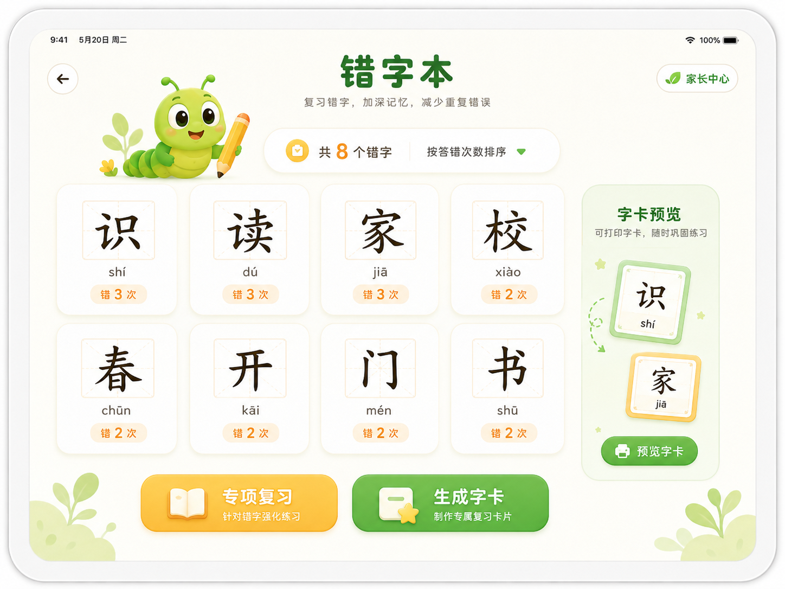
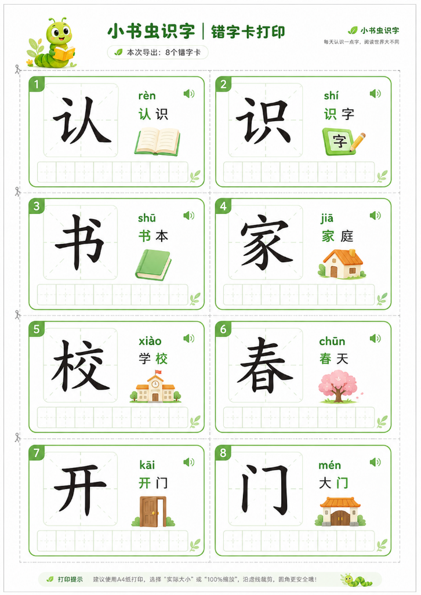
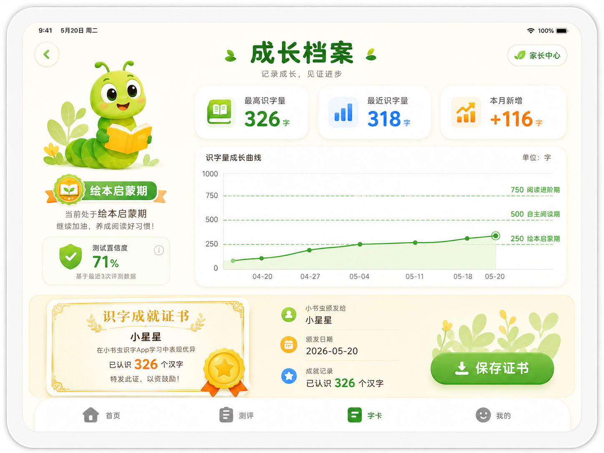

基于您提供的“小书虫识字”App的截图、功能描述和审核经历，我为您量身定制了一份**“识字核心模块”的详细产品设计方案**。这份方案不仅复刻了原App的亮点，还结合了儿童认知心理学与教育数据模型，非常适合作为您后续开发或优化的蓝图。

---

# 「小书虫识字」核心模块详细产品设计方案

## 一、 产品定位与设计理念
- **目标用户**：3-6岁（幼小衔接阶段）儿童及其家长。
- **核心痛点**：市面识字App广告多、诱导付费、关屏困难、缺乏科学数据支撑。
- **设计原则**：
  - **极简纯粹**：零广告，界面干净，无任何干扰元素。
  - **家长主导**：使用时长家长设定，学习报告家长掌控。
  - **科学分阶**：严格对标《义务教育语文课程标准》，提供可视化成长曲线。

---

## 二、 核心功能模块拆解与交互设计

### 模块一：识字量智能测评（核心测试区）
*对应图1：翻牌字卡与拼音选择*

- **玩法机制**：**“翻牌配对”模式**。屏幕显示一个汉字，下方提供4个拼音选项（含3个干扰项）。
- **交互流程**：
  1.  **出题逻辑**：从根据当前阶段（例如“绘本启蒙期”）的字库中随机抽取。
  2.  **反馈机制**：点选正确，卡片亮绿色并伴有鼓励音效（如“真棒！”）；点选错误，卡片亮红色并提示正确答案，同时该字自动进入**“错字本”**。
  3.  **进度条**：顶部显示测试进度（如“24/25”），缓解儿童焦虑，建立可预期感。
- **算法策略（关键点）**：
  - **自适应出题**：前3题为难度试探，若连续答对，则自动调取更高阶字库（如从“字芽初萌”进入“绘本启蒙期”）；若答错则降维，确保测试结果真实反映认字水平。
  - **置信度计算**（参考图4的“71%”）：测试结束后，系统根据答对比例、耗时、错题分布，计算出一个置信度阈值（如>60%为有效测试），避免乱点带来的数据失真。

### 模块二：错字本与强化复习
*对应图4右下角的“8个错字”*

- **功能设计**：
  - **自动收录**：测评中答错的字，自动生成“错字本”，并按“答错次数”倒序排列（易错字置顶）。
  - **强化训练**：支持“错字专项PK”，仅针对错字进行重复测试，直至该字连续答对3次以上，系统自动将其移入“熟字库”。
  - **实体打印**：提供“一键生成错字卡”，支持A4纸排版打印（含拼音及田字格），方便家长制作纸质闪卡进行线下复习。

### 模块三：识字档案与可视化成长报告
*对应图2、图3、图4的数据面板*

- **数据看板（首页/档案）**：
  - **核心指标**：**最高识字量**（峰值记录） vs **最近识字量**（当前水平），直观对比进步。
  - **阶段勋章**：根据识字量区间授予称号（如“字芽初萌”、“绘本启蒙期”、“自主阅读期”），赋予儿童成就感。
- **成长曲线图（核心亮点）**：
  - **双轴设计**：X轴为测试日期，Y轴为识字量（0-1000字）。
  - **参考线标注**：在图表中嵌入绿色虚线（如250、500、750字），并标明各阶段的名称（如“绘本启蒙期”）。通过图表，家长可清晰看到孩子处于哪个“能力跃迁带”。
  - **趋势预测**：根据近5次测试数据，生成一条淡橙色的置信区间线（如图3中的虚线区域），预测孩子到达下一阶段的时间点。

### 模块四：学习小结与证书激励
*对应图2、图4的证书按钮*

- **月度/周度报告**：生成“本月成长·学习小结”（如图2的“+116字”）。
  - 包含：累计测试次数、总识字量、本月新增识字量。
- **成就证书系统**：
  - 每次有效测试后，自动生成一张“识字成就证书”（如图4所示）。
  - 证书内容包含：测试日期、识字量、阶段称号及置信度。支持保存至相册或分享至家庭群，作为亲子互动的强化激励。

---

## 三、 家长管控与辅助功能模块

- **无广告与安全锁**：**严格遵守Apple儿童应用政策**。严禁植入广告、第三方SDK及外部跳转链接。设置家长控制面板（需家长手势/密码解锁），防止儿童误触退出或修改设置。
- **时间管理**：内置“每日学习时长”设定，支持“15分钟/30分钟/1小时”可选。时间耗尽时，屏幕自动锁定并提示“休息一下”，需家长密码解锁。
- **字卡打印服务**：支持“已学字卡”批量导出。生成PDF文件，包含大字、标准楷体、拼音和组词，方便家长打印成册。

---

## 四、 技术架构与数据模型（产品落地参考）

1.  **字库分级数据结构**（参照教育部标准）：
   - **Level 1（0-250字）**：基础象形字、高频词（日、月、水、火）。
   - **Level 2（250-500字）**：偏旁部首组合、常见生活字（家、校、开、关）。
   - **Level 3（500-750字）**：小学一年级上册生字表（人教版/部编版）。
   - **Level 4（750-1000字）**：小学一年级下册生字表及部分绘本常用字。
2.  **本地+云端存储**：测试数据优先本地存储（确保断网可用），家长联网后自动同步至云端，避免换设备数据丢失。
3.  **防误触机制**：针对儿童手指面积大、点击不精准的特点，UI点击热区需至少放大至 `44x44pt`（iOS标准），并延长长按响应时间。

---

## 五、 运营与迭代规划

- **阶段一（冷启动）**：快速验证测试功能，聚焦“测识字量”和“错字本”两个核心闭环。
- **阶段二（数据沉淀）**：上线“成长曲线”和“家长周报”，鼓励家长每周打卡测试，积累数据模型。
- **阶段三（内容扩充）**：增加“绘本阅读联动”功能（根据认字量推荐对应的分级读物），将单纯识字转化为阅读能力，真正实现“幼小衔接”的最终目标。

---

**💡 给开发者的特别提醒（基于您审核9天过审的经验）：**
针对儿童类App，Apple审核重点关注**“隐私政策”**和**“收集IDFA（广告标识符）”**。若后续版本增加联网同步功能，必须在开屏页面明确弹窗告知家长“数据同步仅用于记录成长，不用于商业用途”，并确保后台接口符合GDPR/国内数据安全法要求，以加速后续版本过审。

如果您需要针对其中的**“测试算法（怎么出题才能测准）”**或**“打印页面布局”**做更细化的UI/UX草案，我们可以继续深入探讨。