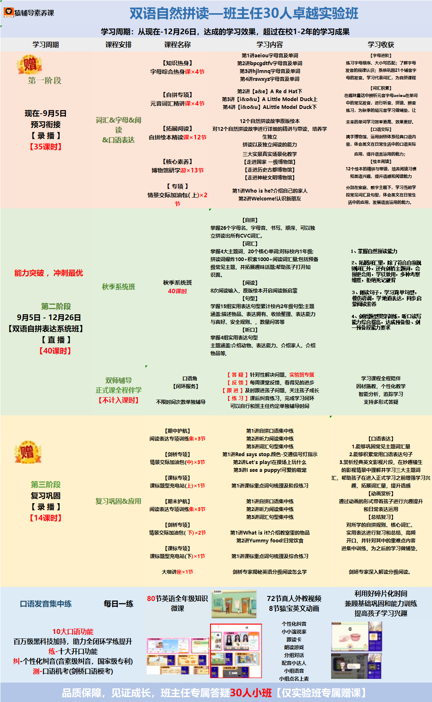

猿编程 - 自然拼读项目 - 计划

双语自然拼读一班主任30人卓越实验班
学习周期:从现在-12月26日，达成的学习效果，超过在校1-2年的学习成果
学习周期
课程安排
课程名称
学习内容
学习收获
第1讲aeiou字母音及单词g2讲bpcgdtfv宇母音及单词第3进hilmna字母音及单词第4i讲rswxyz字母音及单词
赠第一阶段
[字母进阶】东习字母顺序、大小写匹配;了解字母发音的规律认识;系统巩固21个辅音字母的发音。学习代表词汇，为自拼课程
[知识热身]字母综合热身课x4节
在趣味童话中辨析元音字母aeiou在单词中的常见发音，进行听音、拼读、辨音练习，为秋季的短元音学习做铺垫，让
第2进[a&elARedHat下第3讲 [i&o&u] A Little Model Duck上第4讲 [i8o&u] ALittle Model Duck下
[自拼专项]元音词汇精讲课x4节
现在-9月5日预习衔接【录播】【35课时】
12个自然拼读故事原版绘本并读故事进行详细的精进与带读，培养学绘本精读课x12节拼读以及独立阅读的能力三大实景真实场景化教学[走进国家一级博物馆】[走进历史古都博物馆]【走进神秘文明博物馆】
词汇&宁母&阅
[口语交际]牌手博物馆、运用剑桥体系经典口语内容，体会英文在日常生活中的口语实际
&口语表达
用，提升语言运用的能力12个绘本的精讲与带读，培养阅读习惯和英语兴趣，提升语感和阅读能力
【核心素养】博物馆研学游x13节
[专项】情景交际加油包(上)x2
分别在家庭、数字主题下，学习当前学没常见词汇及句型，体会英文在日常生
第1讲Who is he?介绍自己的家人第2讲Welcome!认识新朋友
掌握26个字母名、字母音可以独立拼读出所有CVc词汇。
掌握4大主题词，20个核心单词;对标校内1年级:拼读词爆炸100+积索1000+阅读词汇量包括预备级常见主题，并拓展趣味话题:帮助孩子打开知
掌握自然拼读能大
能力突破，冲刺最优
[阅读】
秋季系统班40课时
秋季系统班
8次阅读输入，原版绘本开启阅读新启蒙学握15组实用表达句型累计校内2年级句型;主题涵盖:描述物品、表达拥有、收拾整理、表达能力与喜好、安全规则，数量问答等【听口】学握4组实用表达句型主题通盖:介绍动物、表达能力、介绍家人、介绍物品等，
第二阶段9月5日·12月26日【双语自拼表达系统班]【直播】(40课时】
、剑桥题型贯穿训练，听口读写内达成授备级、剑
[答疑]针对性解决问题，实验班专属[反馈]每周课堂反馈，看得见的进步[跟进】及时跟进孩子问题，关注孩子成长习课后纠音练习，完成学习闭环可以自行和班主任约定单独辅导时间
双师辅导正式课全程伴学[不计入课时】
学习课程全程陪伴因材施教，个性化教学智能分析，追踪学习支持多形式答疑
闭环服务】
不限时间次数单独辅导
第1进自拱口语集中练第2讲听力阅读集中练第3讲词汇句型集中练第1讲Red says stop.颜色-交通信号灯指示第2讲Let's play!在操场上玩什么第3讲I see a puppy!可爱的萌宠
表达专项训练
1.能够巩固常见主题词汇量2.能够积累堂用口语表达句子3.堂析经典英文影视片段，在妙趣横生的影视情景中理解并学习三大主题词帮助孩子在进入正式学习之前增强学习兴拓展词汇量，提升语感[动画赏析]通过动画的形式带着孩子进行兴趣提升和日常表达运用[总结复习]对所学的自拼规则、核心词汇、实用表达进行复习和总结，高频开口，并针对其中的重难点内容进集中训练，为之后的学习做铺垫
赠
[剑桥专项】青景交际加油包(中)x3节
【课标专项】题型充电站(上)x1节
第三阶段复习巩固【录播】【14课时】
[期末护航】读表达专项训练集x3节
第1讲自拼门语集中练第2进听力阅读集中练第3讲词汇句型集中练
复习巩固&应用
[剑桥专项]景交际加油包(下)x2节【课标专项】果标题型充电站(下)x1节
1讲Whatis it?介绍教室里的物品第2讲Yummy food!日常饮食
1讲课标重点词句梳理及综合练习
大咖讲座x1节
剑桥专家揭秘英语分级阅读怎么学
剑娇专家深入解读分级阅读。
利用好碎片化时间兼顾基础巩固和能力训练提高孩子学习兴趣
80节英语全年级知识微课
72节真人外教视频8节猿宝英文动画
口语发音集中练
每日一练
小小演说家分组对话記音小达人组点名上
10大口语功能百万级黑科技加持，助力全闭环学练提升练-十大开口功能4·个性化纠音(音素级纠音，国家级专利测-口语机考(剑桥口语模考)
品质保障，见证成长，班主任专属答疑30人小班
【仅实验班专属赠课】
