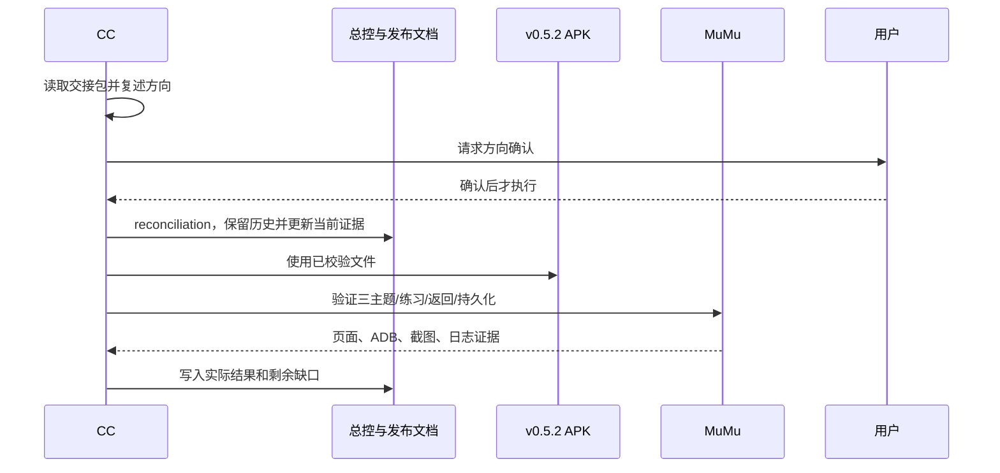

# 接手流程图

```mermaid
sequenceDiagram
    participant CC
    participant Docs as 总控与发布文档
    participant APK as v0.5.2 APK
    participant MuMu
    participant User as 用户
    CC->>CC: 读取交接包并复述方向
    CC->>User: 请求方向确认
    User-->>CC: 确认后才执行
    CC->>Docs: reconciliation，保留历史并更新当前证据
    CC->>APK: 使用已校验文件
    CC->>MuMu: 验证三主题/练习/返回/持久化
    MuMu-->>CC: 页面、ADB、截图、日志证据
    CC->>Docs: 写入实际结果和剩余缺口
```

