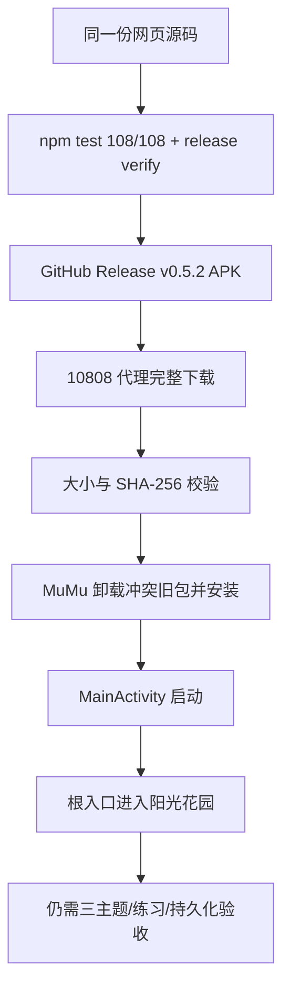

# 关键发现

## 已验证结论

- ✅ 根入口的发布合同为“三个幼儿主题在前、成人/儿童在后”的五入口顺序；本轮 `npm run release:verify` 通过。
- ✅ 源码回归本轮为 108/108，通过数与总数自洽：108 = 108 + 0 + 0 + 0（通过 + 失败 + 跳过 + 待办）。
- ✅ 代理下载得到的 APK 与 Release 记录一致：60,140,796 bytes，SHA-256 为 `40cbf426afe619354a04307dee0532aaa7cb0cdb0935c7df2c9ae594c1f66fa8`。
- ✅ MuMu `127.0.0.1:16384` 为 `device`；安装返回 `Success`；前台 Activity 为 `com.nonomil.personalworkbench/.MainActivity`。
- ✅ 点击根入口第一个幼儿卡后，截图显示“阳光花园工作台”首页、阳光余额、任务进度、花园防卫和学习任务入口。
- ✅ 安装冲突根因是旧包与新 APK 签名不同，不是下载文件损坏；卸载旧包后安装成功。

## 待验证假设

- 🔲 三个幼儿主题是否都能在 APK 内正确切换且共享同一份成长数据，需要设备操作逐项确认。
- 🔲 轻量练习完成、奖励幂等、返回花园和重启后状态保留，需要设备级操作验证；源码测试不能替代这条证据。

## 口径说明

- 采用本交接包的本轮命令和设备输出作为 APK/MuMu 当前事实；旧文档中“尚未下载/安装”的文字是历史状态，需要更新而不是删除。
- `versionName=1.0` 和 `versionCode=1` 是 Android 包内部当前事实；不要把 Git tag `v0.5.2` 写成 Android 内部版本号已经同步。

## 证据流

## 被否决方案

- ❌ 直接使用 6 MB 左右的残缺 APK：文件不完整，不能安装或作为证据。
- ❌ 只根据网页测试通过宣称 APK 全功能通过：网页、APK 下载、安装和设备流程必须分层记录。

