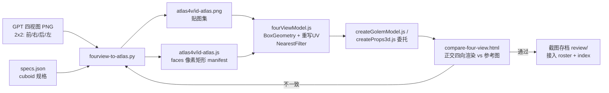

# 解决方案：四视图机械投射管线

> 一句话结论：以 specs.json 的 cuboid 规格为骨架，把 2×2 四视图的像素按视图
> 语义机械裁切到每个盒面，打包成贴图集 + manifest，运行时按 manifest 建盒重写 UV。

## 管线图



## 视图语义（容易搞反，务必对照）

2×2 布局：左上=前（相机 +z，图像 x = 模型 +x）、右上=右（相机 +x，图像 x = 模型 −z）、
左下=后（相机 −z，图像 x = 模型 −x，需镜像 x 区间）、右下=左（相机 −x，图像 x = 模型 +z）。
`compare-four-view.html` 的渲染象限与此一致，WebGL viewport y 朝上，顶行在 y=512。

## 核心算法（fourview-to-atlas.py，~300 行）

1. 每视图内缩 4px 后测 subject bbox（背景色取角点，色距阈值 30）。
2. 垂直映射用全身 bbox 线性映射；**水平映射分带局部对齐**——每个部件在自己
   高度带的中段 60% 行重测轮廓（GPT 视图非严格正交）。
3. **遮挡剥离**：只对凸出 >1.2px 且投影面积 <15% 底面的小部件（鼻子）做剥离
   （涂回背景色，由 clean_bg 回填底色）；平贴细节（眉/眼/藤蔓）保留在底面贴图。
4. **clean_bg**：切片内背景色像素回填为主色；有效像素 <25% 时整片用规格色。
5. **覆盖率兜底**：侧面切片覆盖率 <55% → 镜像对侧；两侧都低 → 用正面；
   背面低 → 用正面。
6. 顶/底面不可见 → 用正面切片顶/底 1/4 行的均色平涂。
7. shelf 打包进 512 宽、高度取 2 的幂的图集，pad 2px 防渗色。

## 运行时（fourViewModel.js）

- BoxGeometry 面序 `px,nx,py,ny,pz,nz`，每面 4 个 uv 顶点按 manifest 矩形重写。
- NearestFilter + 关 mipmap + SRGBColorSpace；贴图按 URL 缓存，迭代时传
  `texQuery` 时间戳穿透缓存。
- `leg[LR]/arm[LR]` 自动挂 pivot 摆动（`userData.tick(t, moving)`）；
  `emissive: {match:'eye', color}` 支持发光眼。
- 工厂委托模式：`createGolemModel.js` / `createProps3d.js` 的 createVillager 在
  atlas 数据存在时委托 `BlockLegendFourView.build`，否则回退旧程序模型——
  游戏在图集缺失时不会崩。

## 调试经验（8 条，均为本轮实际踩坑）

| # | 症状 | 根因 | 修法 |
| --- | --- | --- | --- |
| 1 | 铁傀儡头整片变平涂 | 铁灰 #c4ccd2 与米色背景色距仅 ~34，阈值 40 把头吃成背景 | BG_THRESHOLD=30 |
| 2 | 侧脸/五官整体偏移 | GPT 视图非严格正交，全身 bbox 线性映射错位 | 分带局部对齐 |
| 3 | 头部切片混进手臂像素 | 邻接部件顶进本部件高度带 | 只测中段 60% 行 |
| 4 | 村民鼻子双重渲染（脸上一个+盒子一个） | 鼻子像素被烤进头贴图又单独建盒 | 凸出>1.2px 才剥离 |
| 5 | 手臂出现灰斑 | 低覆盖切片残余像素是阴影灰，主色统计不可信 | <25% 覆盖整片规格色 |
| 6 | bbox 顶到 511 | 四格分隔线被当 subject | 视图内缩 4px |
| 7 | 改了脚本页面没变化 | TextureLoader 浏览器缓存 | URL 加时间戳 query |
| 8 | 页面空响应 curl exit 52 | Windows 多个僵尸进程叠监听同端口 | netstat 找 PID 全杀，换端口 |

## 局限（如实）

- 顶/底面平涂；被垂臂遮挡的身体侧面退化为镜像/正面。
- 姿势差异（村民交叉臂）无法逐像素还原，靠兜底色收敛。
- 更高保真需升级 img2blockbench 完整实现（真 UV 展开 + .bbmodel）。

## 环境与命令

```powershell
# 生成图集（Python 需 Pillow）
python prj/games/blocklegend/tools/fourview-to-atlas.py --model golem
python prj/games/blocklegend/tools/fourview-to-atlas.py --model villager

# 本地预览（若 4230 被占换端口；注意僵尸进程坑 #8）
python -m http.server 4230
# http://127.0.0.1:4230/prj/games/blocklegend/compare-four-view.html
# http://127.0.0.1:4230/prj/games/blocklegend/review-roster.html

# 测试
node --test tests/blocklegend.test.mjs   # 当前 125 pass
```
