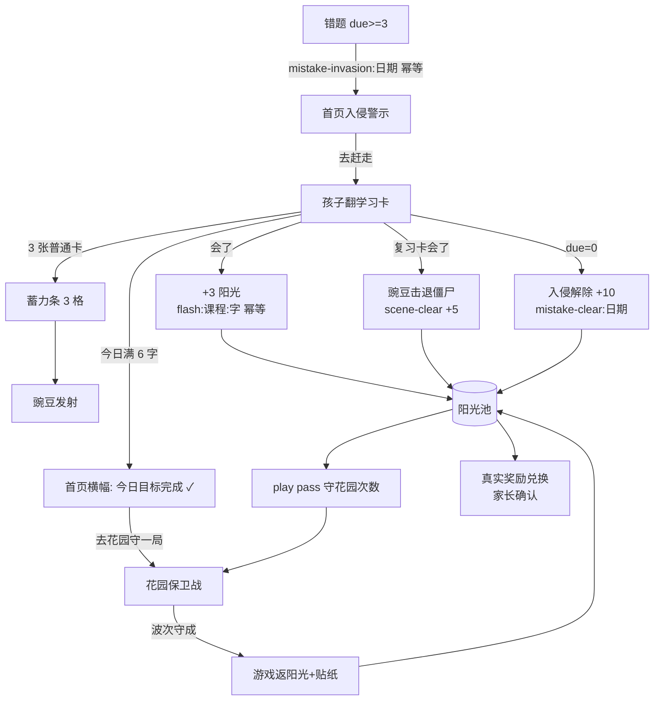
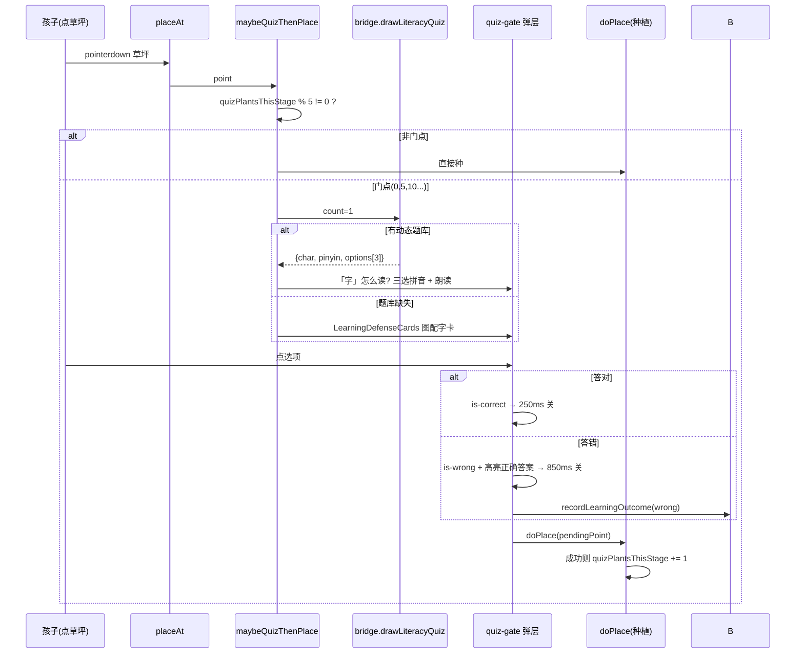
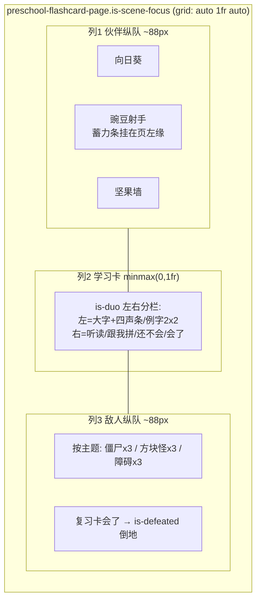

# 图解 · 学习↔游戏闭环与知识门时序

## 1. 闭环总览（会了卡 → 阳光 → 游戏权 → 真实奖励）

```mermaid
flowchart TD
    KID[孩子翻学习卡] -->|会了| SUN1[+3 阳光<br>flash:课程:字 幂等]
    KID -->|复习卡会了| ZOE[豌豆击退僵尸<br>scene-clear +5]
    KID -->|3 张普通卡| CHARGE[蓄力条 3 格] --> PEA[豌豆发射]
    KID -->|今日满 6 字| GOAL[首页横幅: 今日目标完成 ✓] -->|去花园守一局| BATTLE
    MISTAKE[错题 due>=3] -->|mistake-invasion:日期 幂等| INV[首页入侵警示] -->|去赶走| KID
    KID -->|due=0| CLR[入侵解除 +10<br>mistake-clear:日期]
    SUN1 --> POOL[(阳光池)]
    ZOE --> POOL
    CLR --> POOL
    POOL --> PLAY[play pass 守花园次数] --> BATTLE[花园保卫战]
    BATTLE -->|波次守成| MORE[游戏返阳光+贴纸]
    MORE --> POOL
    POOL --> REWARD[真实奖励兑换<br>家长确认]
```

## 2. 知识门时序（每关首棵 + 每 5 棵）

```mermaid
sequenceDiagram
    participant K as 孩子(点草坪)
    participant P as placeAt
    participant Q as maybeQuizThenPlace
    participant D as bridge.drawLiteracyQuiz
    participant O as quiz-gate 弹层
    participant R as doPlace(种植)
    K->>P: pointerdown 草坪
    P->>Q: point
    Q->>Q: quizPlantsThisStage % 5 != 0 ?
    alt 非门点
        Q->>R: 直接种
    else 门点(0,5,10...)
        Q->>D: count=1
        alt 有动态题库
            D-->>Q: {char, pinyin, options[3]}
            Q->>O: 「字」怎么读? 三选拼音 + 朗读
        else 题库缺失
            Q->>O: LearningDefenseCards 图配字卡
        end
        K->>O: 点选项
        alt 答对
            O->>O: is-correct → 250ms 关
        else 答错
            O->>O: is-wrong + 高亮正确答案 → 850ms 关
            O->>B: recordLearningOutcome(wrong)
        end
        O->>R: doPlace(pendingPoint)
        R->>R: 成功则 quizPlantsThisStage += 1
    end
```

## 3. 三列战场布局（800×360 APK 横屏）

```mermaid
flowchart LR
    subgraph page["preschool-flashcard-page.is-scene-focus (grid: auto 1fr auto)"]
        direction TB
        subgraph L["列1 伙伴纵队 ~88px"]
            P1[向日葵]
            P2[豌豆射手<br>蓄力条挂在页左缘]
            P3[坚果墙]
        end
        subgraph C["列2 学习卡 minmax(0,1fr)"]
            CARD["is-duo 左右分栏:<br>左=大字+四声条/例字2x2<br>右=听读/跟我拼/还不会/会了"]
        end
        subgraph R2["列3 敌人纵队 ~88px"]
            E1[按主题: 僵尸x3 / 方块怪x3 / 障碍x3]
            E2[复习卡会了 → is-defeated 倒地]
        end
    end
    L --- CARD --- R2
```

图与正文的数字/字段口径以
[关键发现](../背景上下文/关键发现.md) 与 [测试分析报告](../测试分析报告.md) 为准。
