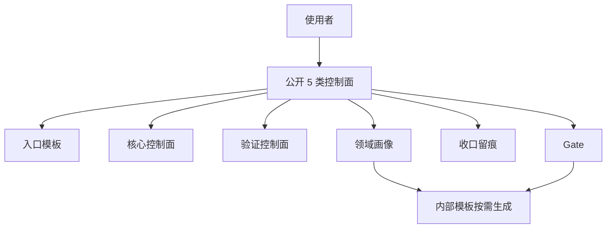

# 任务模板说明

当前目录里的模板不少，但日常使用时**不要把它们当成二十多个独立文档去记**。

更实用的理解方式是：**缩模板认知层，不缩模板文件层**。

算法验证、参考实现对齐、生产候选裁决、多 Agent 审核和 solution-loop 合入前，默认先用 `evidence-decision-task-card.md` 写一张短卡：先给人看结论边界，再按需生成 AI 执行包。

- 对使用者：只暴露 5 类公开控制面
- 对系统：保留现有模板文件，按触发条件补内部件
- 对项目初始化：先选领域画像，再装配模板，不要一上来把所有卡都摊给用户



## 公开 5 类控制面

| 类别 | 你主要记什么 | 代表文件 |
|---|---|---|
| 入口 | 任务从哪种重量开始 | `task-lite.md` / `task.md` / `task-full.md` / `loop-spec.md` |
| 核心控制面 | 需求、步骤、验收怎么收口 | `requirements-checklist.md` / `steps.md` / `acceptance.md` |
| 验证控制面 | 测试怎么前移、分阶段止损 | `test-plan.md` / `test-report.md` |
| Gate | 什么时候必须停下来人工确认 | `direction-check.md` / `execution-check.md` / `stage-gate.md` / `final-check.md` |
| 收口留痕 | 结束后留什么、下次怎么续上 | `handoff.md` / `session-journal.md` / `spec-update.md` |

## 内部件：按需生成，不要求主动记忆

下面这些文件**不是删掉**，而是降级成系统侧的内部件。用户一般不需要先记住它们，只有触发条件出现时才拉起。

| 内部件 | 什么时候触发 | 作用 |
|---|---|---|
| `requirements-source.md` | 原始需求零散、来源很多、需要沉淀原文时 | 先把需求源整理成结构化输入 |
| `evidence-decision-task-card.md` | 算法验证、对齐、生产候选、多 Agent 或 solution-loop 开始发散时 | 先收窄成一个裁决问题、证据要求、停止条件和唯一下一步 |
| `source-requirements-alignment.md` | 担心原始需求点在分解时被漏掉时 | 核对“原始要求”与“需求清单”是否一致 |
| `task-decomposition.md` | 任务拆分复杂、多人/多代理并行、L2/L3 时 | 固化子任务粒度、依赖和验证边界 |
| `change-request.md` | 新需求、方向纠偏、测试证伪、新启发时 | 先冻结推进，再决定 `patch / replan / reset` |
| `.meta.yaml` | 脚本、索引、自动化需要元数据时 | 机器读的模板元信息，不作为人工主入口 |

## 项目初始化先走领域画像

用户说“初始化项目”时，不建议直接把全部模板铺开。更好的固定顺序是：

1. 先看 [project-init-guide.md](./project-init-guide.md)
2. 如果想直接按问答卡收敛，先看 [project-init-interview.md](./project-init-interview.md)
3. 再从 4 类领域画像里选主画像：
   - [software-dev.md](./profiles/software-dev.md)
   - [algorithm.md](./profiles/algorithm.md)
   - [ui-optimization.md](./profiles/ui-optimization.md)
   - [deep-learning.md](./profiles/deep-learning.md)
4. 如果用户对流程、测试方法、证据格式还没想清楚，再用 `/grill-me` 逐项追问
5. 最后只生成本轮真正需要的入口模板和控制面

### 领域画像速览

| 领域 | 默认入口 | 验证重点 | 常拉起的内部件 |
|---|---|---|---|
| 软件开发 | `task-lite.md` / `task.md` | 单元、集成、回归、兼容 | `requirements-source.md`、`change-request.md` |
| 算法 | `task.md` / `task-full.md` | 指标、阈值、样本覆盖、基线对比 | `source-requirements-alignment.md`、`task-decomposition.md`、`change-request.md` |
| UI 优化 | `task.md` | 截图、交互路径、信息层级、回归 | `requirements-source.md`、`change-request.md` |
| 深度学习 | `task-full.md` / `loop-spec.md` | 数据集、标签、复现、训练/验证/测试指标 | `requirements-source.md`、`task-decomposition.md`、`change-request.md` |

## 重量分级

为了避免模板越来越重，再把它们分成 3 类理解。

这里的“等级”是**仓库文件视角**，不是要求用户把所有文件都背下来。

| 分级 | 文件 | 默认行为 |
|---|---|---|
| 硬门禁 | `requirements-checklist.md` / `source-requirements-alignment.md` / `task-decomposition.md` / `test-report.md` / Gate 文档 / `acceptance.md` / `change-request.md` | 可阻断阶段推进 |
| 软提醒 | `spec-update.md` / `session-journal.md` | 默认生成，推荐回写，但不应卡死 `done` |
| 候选沉淀 | `docs/spec/golden-candidates.md` | 只在值得复用时登记 |

## 模板总表（仓库文件视角）

下面是目录里的完整模板清单，方便维护者和脚本作者查找。**这不是给使用者的记忆清单。**

- `task-lite.md`
- `task.md`
- `task-full.md`
- `loop-spec.md`
- `evidence-decision-task-card.md`
- `project-init-guide.md`
- `project-init-interview.md`
- `profiles/README.md`
- `profiles/software-dev.md`
- `profiles/algorithm.md`
- `profiles/ui-optimization.md`
- `profiles/deep-learning.md`
- `change-request.md`
- `requirements-source.md`
- `source-requirements-alignment.md`
- `requirements-checklist.md`
- `steps.md`
- `acceptance.md`
- `test-plan.md`
- `test-report.md`
- `spec-update.md`
- `session-journal.md`
- `handoff.md`
- `.meta.yaml`

## 按等级选入口模板

| 等级 | 入口模板 | 典型入口 | 适用场景 |
|---|---|---|---|
| L0 | `task-lite.md` | `/create-task` | 小改动、验证很快、无需阶段 Gate |
| L1 | `task.md` | `/create-task` 或 `/start-task` | 标准任务，先收边界再进计划包 |
| L2 | `task-full.md` | `/plan-checklist` | 跨模块、隐性规则多、要显式拆分与隔离 |
| L3 | `loop-spec.md` | `/solution-loop` | 持续运行、maker/checker/golden 长循环 |

补一句最实用的：

- 不想自己判断时，先走 `/start-task`
- 想让系统按 L0/L1/L2/L3 自动推荐，补 `task-router` skill
- 默认先从低一级开始，执行中再升级

如果你只想记住最少的入口，记下面这一组就够了：

- 任务开始：`task-lite.md / task.md / task-full.md / loop-spec.md`
- 真正推进：`requirements-checklist.md`、`steps.md`、`acceptance.md`
- 真正止损：`test-report.md`、`/gate`
- 方向变了：系统自动拉起 `change-request.md`

## 从需求访谈到计划包的继承链

推荐把这些模板放在一条固定压缩链里使用：

0. `项目初始化 / 领域定型`
   - 先看：`project-init-guide.md`
   - 再选：`profiles/*.md`
   - 如果用户只知道“想做算法 / UI / 深度学习 / 软件功能”，但还说不清测试、数据或交付格式，先走一次 `/grill-me`
1. `需求分析`
   - 可选先填：`requirements-source.md`
   - 简单任务可跳过
2. `/grill-me`
   - 把“症状描述”压成“任务定义骨架”
3. `source-requirements-alignment.md`
   - 先确认原始需求文档里的点有没有进需求分解
4. `/create-task`
   - 把任务定义骨架压成 `task.md`
5. `/plan-checklist`
   - 把 `task.md` 继续压成：
     - `requirements-checklist.md`
     - `solution.md`
     - `steps.md`
     - `acceptance.md`
     - `test-plan.md`
     - `test-report.md`
   - 然后立刻预填测试映射骨架（默认顺手自动跑，不等用户再提醒）：

```bash
python .claude/scripts/taskctl.py prefill-test-maps \
  --task Txxx
```

一句话理解：

- `grill-me` 先问透
- `source-requirements-alignment.md` 先对齐原始需求基线
- `requirements-checklist.md` 先把需求点压成短控制面
- `task.md` 先收边界
- `task-lite.md / task.md / task-full.md / loop-spec.md` 代表四种不同重量的入口骨架
- `acceptance.md` 定义“算不算通过”
- `test-plan.md` 定义“怎么验证它通过”
- `test-report.md` 记录“每一阶段测出来什么，是否允许推进”
- `spec-update.md` 决定“这次有没有新规范值得沉淀”
- `session-journal.md` 决定“下次会话从哪里接最省脑子”
- `docs/spec/golden-candidates.md` 决定“这次有没有高质量样板值得下一轮直接复用”

注意：

- `spec-update.md` 与 `session-journal.md` 是高价值的默认提醒，但不是每次都应该挡住任务收口
- `golden-candidates.md` 更是“有则登记”，不是“无则失败”

补一句最实用的：

- `requirements-checklist.md` 一出，就先跑一次 `prefill_test_maps.py`
- 让 `R1/R2/R3...` 自动进 `test-plan.md` 和 `test-report.md`
- 如果 `requirements-checklist.md` 里已经填了 `验证命令 / 预计时长`，也会一起带进 `test-plan.md`
- 避免后面再手抄一次需求点到测试阶段的映射
- `task-decomposition.md` 一旦写出真实分解项，就跑一次 `taskctl verify-decomposition`
- 脚本会在校验通过后，顺手把 `acceptance.md` 里的“子任务索引”按分解表预填一轮
- 如果 `task-decomposition.md` 同时填了 `需求点` 列，`acceptance.md` 里的对应需求点也会一起带过去
- 如果 `task-decomposition.md` 与 `requirements-checklist.md` 都已经写实，`verify-decomposition` 还会顺手核对：
  - `需求点`
  - `验证命令`
  - `预计验证时长`

## 极简样板

下面这个例子只展示“字段怎么传”，不追求完整业务细节。

### 1. `/grill-me` 输出摘要

```markdown
## 目标与成功标准
- 表面诉求：帮我把误检降下来
- 真实需求：减少背景误检，同时不能牺牲 NG 召回
- 核心目标：在现有检测链路上增加背景过滤与验证闭环
- 成功标准：OK FPR 下降，NG Recall 不低于当前基线

## 约束与边界
- 已知约束：不改主模型推理逻辑
- 排除项：不引入新深度学习框架
- 风险与未知数：过滤阈值可能误伤浅缺陷

## 实施提示
- 是否需要日志策略：是，basic
- 推荐进入的复杂度模式：标准
```

### 2. `task.md`

```markdown
## What
在现有检测链路上增加背景过滤，并保留基线对比验证。

## Why
减少背景误检，同时不能牺牲 NG 召回。

## 边界
**只改：**
- 背景过滤相关脚本与配置

**不碰：**
- 主模型推理逻辑
- 新框架引入

**执行前需确认（[?]）：**
- 过滤阈值是否会误伤浅缺陷
```

### 3. `acceptance.md`

```markdown
## 功能验收
- [ ] 已增加背景过滤逻辑
- [ ] 可切换回基线模式

## 质量验收
- [ ] 不改主模型推理逻辑
- [ ] 不引入新框架
```

### 4. `test-plan.md`

```markdown
## 测试目标
- [ ] 验证主路径：背景误检下降
- [ ] 验证关键边界：浅缺陷不被误伤
- [ ] 验证回归风险：NG Recall 不低于当前基线

## 日志采集
- [ ] 日志开关：basic
- [ ] 关键字段：过滤前后 bbox 数、最终 verdict、基线对比指标
```

### 4.5 `test-report.md`

这张表专门解决“测试太晚才做、测试结果太晚才看”的问题。

推荐做法：

- 前提验证后就写一轮
- 最小主链路跑通后再写一轮
- 关键边界、阶段回归、扩量前、最终验收各写一轮
- 每轮测试都给出一句结论：`允许推进 / 调整后重测 / 停止推进`

如果任务很长、一次正式测试要几个小时，更应该用这张表把测试拆前、拆小、拆阶段。

这个样板要传达的不是“怎么写漂亮文档”，而是：

- 上游问出来的结论不要丢
- 每一层只做一次压缩
- 不要在下游重新发明一套目标表述

### 5. `requirements-checklist.md`

这张表专门解决一种很常见的漂移：

- 需求讨论时 AI 理解了
- 方案阶段写进了长文
- 计划、代码、测试阶段有人忘了

推荐用法：

- 需求讨论后先生成
- 每个需求点写成短句
- 每列代表一个阶段：
  - 人工确认
  - 方案审查
  - 计划审查
  - 代码审查
  - 测试审查
  - 最终验收
- 每次 `/gate` 都提醒人工顺手看这张表有没有遗漏项
- 但在第一次方案冻结前，不能只看这张表，还要先看 `source-requirements-alignment.md`
- 先确认“原始需求里提过的点”已经进表，再审方案、计划、代码
- 推荐顺序是：先 `review-with-subagent`，再回写本表，再 `/gate`
- 进入执行前，`人工确认 / 方案审查 / 计划审查` 三列最好已经闭合
- 如果测试或验证发现了新需求、新约束、新边界，不要只改代码，要先回补本表，再更新方案和计划

### 5.5 `source-requirements-alignment.md`

这张表专门拦一种更早期、也更隐蔽的跑偏：

- 原始需求文档里写了 A/B/C
- 需求分解时只记住了 A/B
- 后面方案、计划、代码、测试都认真围绕 A/B 工作
- 结果整条流程都“合规”，但从一开始就漏了 C

推荐用法：

- 需求讨论收口后立刻生成
- 在第一次 `/gate` 放行到方案/计划阶段前先看它
- 每一行都说明：原始需求点最终映射到了 `requirements-checklist.md` 的哪一行
- 如果发现原始需求点没有映射项，先补需求分解表，不要带着缺口进入方案阶段

### 6. `steps.md`

`steps.md` 不只是打勾清单，它还承担“前提验证记录”。

凡是方案里写了下面这类承诺，步骤里都应该有对应的验证动作：

- 复用已有函数 / 类 / 脚本
- 使用指定库 / 指定工具 / 指定入口
- 使用指定数据集 / 指定配置 / 指定日志来源

推荐补成这种结构：

- 先验证存在性或可用性
- 记录证据路径或搜索命令
- 再进入真正实现

如果结论是：

- `不存在`
- `不可用`
- `无法复用`
- `改用替代方案`

那就不要直接往下做，而要：

1. 在 `steps.md` 留下验证证据
2. 回写 `requirements-checklist.md`
3. 更新 `solution.md` / `acceptance.md` / `test-plan.md`
4. 重新独立审查
5. 重新 `/gate`

这一步的目的，就是防止出现“方案什么都对，但执行时因为一个错误前提换了方法，后面所有审查都没拦住”。

### 7. 分阶段测试与 TDD 式推进

如果任务链路长、试错成本高，推荐把测试也变成门禁：

1. 先在 `test-plan.md` 定义每一阶段测什么
2. 每阶段结束后回写 `test-report.md`
3. 先做测试审查
4. 审查通过后再推进下一阶段计划

这样可以把“等最终测试几小时后才发现方向错了”的成本，改成“在较早阶段就止损”。

## 需求经常会变：不要静默改正文档

这一套模板最容易缺的一环不是“怎么开始”，而是：

- 用户半路加了新需求
- 跑测试后发现原方向不对
- 和 AI 对话中冒出更好的路线
- 数据 / review / 复盘推翻了原假设

这时最危险的做法是：

1. 先把 `task.md`、`steps.md`、`acceptance.md` 悄悄改掉
2. 再继续执行
3. 几轮之后谁都说不清为什么方向变了

推荐固定做法：

```text
发现变更
-> 先停推进
-> 填 change-request.md
-> 判断 patch / replan / reset
-> 回写受影响文档
-> 重跑对应 gate
-> 再继续 solution-loop
```

### 三种变更级别

| 级别 | 何时用 | 典型动作 | 重入点 |
|---|---|---|---|
| `patch` | 目标不变，只补边界/约束/参数/验证 | 更新 `requirements-checklist.md`、`acceptance.md`、`test-plan.md` | `stage-gate.md` 或 `execution-check.md` |
| `replan` | 目标大体不变，但路线、拆分、前提错了 | 重写 `task.md`、`steps.md`、`acceptance.md` | `direction-check.md` |
| `reset` | 目标变了，或当前产出已不可信 | 旧任务标记 `superseded`，重新开任务 | 回到入口层 |

一句话记忆：

- 小改叫 `patch`
- 路线错叫 `replan`
- 题目变了叫 `reset`

### 什么时候必须开 `change-request.md`

- `stage-gate` 想选“调整后继续”或“停止”
- `direction-check` 想选 `rejected / revised`
- 测试 / 数据 / 评审推翻了原前提
- 用户明确提出新要求，且会影响范围、验收或步骤

### 先改哪几份文档

如果触发了 `change-request.md`，不要只改一个地方。最低限度同步：

- `requirements-checklist.md`
- `task.md`
- `steps.md`
- `acceptance.md`
- `test-plan.md`
- `test-report.md`
- 必要时 `loop-spec.md` 与 `handoff.md`

`session-journal.md` 至少要记一条：**这次为什么变了、从哪个 Gate 重进。**

## Gate 模板

- `direction-check.md`
- `execution-check.md`
- `stage-gate.md`
- `final-check.md`

## 单一入口

推荐只记一个命令：

- `/gate`

由主代理自动判断当前更适合哪张卡：

- 方案阶段 -> `direction-check.md`
- 计划阶段 / 执行前 -> `execution-check.md`
- 执行中间阶段 -> `stage-gate.md`
- 最终收尾 -> `final-check.md`

固定新增要求：

- 需求冻结前先看 `source-requirements-alignment.md`
- 阶段放行前再看 `requirements-checklist.md`

其中有一个固定约定：

- “方案已过，计划已建，准备开始执行” 也算 `execution-check.md`

## 什么时候用 Gate 模板

### `direction-check.md`

用于：

- 方案讨论结束后
- 正式冻结方向前

### `execution-check.md`

用于：

- 第一次真正写代码前
- 更换数据集 / 更换方法 / 扩大规模 / 明显扩张改动范围前

固定附带：

- `Git 确认卡`
- 必要时 `Worktree 判断卡`

### `stage-gate.md`

用于：

- 子阶段结束后
- 小规模验证完成、准备扩大投入前

进入这张卡前，建议至少已经补一轮 `test-report.md`，确认本阶段测试结论允许继续。

如果 Gate 结论是“继续，但下一步属于高成本动作”，也建议顺手补：

- `Git 确认卡`
- 必要时 `Worktree 判断卡`

### `final-check.md`

用于：

- 最终验证完成后
- 正式关闭任务前

## 标准触发短语

- `/gate`
- `先 gate 一下`
- `先输出 gate 卡`
- `先别继续，先 /gate`
- `先做人工确认卡`

## 确认后怎么回写

推荐让主代理在每次 `/gate` 输出时，顺带给一条：

- `python .claude/scripts/write_gate.py --task-id ... --kind ... --status ...`

如果需要看底层展开命令，再退回：

- `python .claude/scripts/solution_loop_state.py set-gate ...`

最常见映射：

- `direction-check.md` -> `--reply ok`
- `execution-check.md` -> `--reply ok`
- `stage-gate.md` 继续 -> `--reply ok`
- `stage-gate.md` 调整后继续 -> `--reply adjust`
- `stage-gate.md` 停止 -> `--reply stop`
- `final-check.md` -> `--reply ok`

如果只想打印 `/gate` 附加卡骨架，也可以直接用：

- `python .claude/scripts/write_gate.py --kind execution-check --print-cards`
- `python .claude/scripts/write_gate.py --kind stage-gate --print-cards --high-cost-next-step`

如果想先打印默认短卡，再决定是否放行，优先用：

- `python .claude/scripts/write_gate.py --kind execution-check --print-short-card`
- `python .claude/scripts/write_gate.py --kind stage-gate --print-short-card --card-mode manual-dual-review`

## 推荐原则

- 不是全文审查，而是短打勾卡
- 每张卡只保留关键判断
- 没有人工确认，不进入下一高成本阶段
- `requirements-checklist.md` 是跨阶段对照表，优先让人工看它，再决定要不要深读长文档
- `test-report.md` 是跨阶段测试对照表，优先让人工或独立审查者先看它，再决定是否推进下一阶段
- `change-request.md` 是内部纠偏闸门，不要求用户平时记住，但一旦方向变了必须先拉起它，再改正文档
