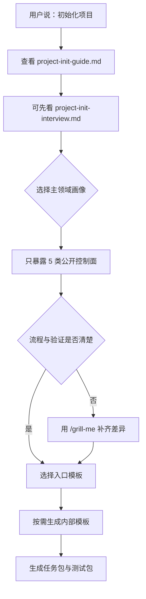

# 项目初始化模板选择指南

> 项目初始化时，先选领域画像，再只装配公开 5 类控制面，内部模板按需生成。

## 1. 先选主领域画像

先判断项目最像下面哪一类，再决定默认模板栈。

| 领域 | 典型任务 | 默认入口 | 核心验证 |
|---|---|---|---|
| 软件开发 | 功能开发、Bug 修复、接口改造、工程重构 | `task-lite.md` / `task.md` | 单元、集成、回归、兼容 |
| 算法 | 阈值策略、规则引擎、视觉算法、标定与评估 | `task.md` / `task-full.md` | 指标、样本、阈值、基线对比 |
| UI 优化 | 桌面界面调整、信息重排、交互减负、视觉一致性 | `task.md` | 截图、路径、层级、易用性回归 |
| 深度学习 | 训练、微调、数据闭环、实验对比、部署前验证 | `task-full.md` / `loop-spec.md` | 数据集、标签、复现、训练/验证/测试指标 |

如果项目明显跨两类以上，先选一个主领域作为入口，再把次领域的验证项补进 `test-plan.md`。

如果用户现在还答不上来，先改看 `project-init-interview.md`，用一问一答把主画像压出来。

## 2. 只暴露 5 类公开控制面

项目初始化时，对用户只展示下面 5 类：

| 类别 | 文件 |
|---|---|
| 入口模板 | `task-lite.md` / `task.md` / `task-full.md` / `loop-spec.md` |
| 核心控制面 | `requirements-checklist.md` / `steps.md` / `acceptance.md` |
| 验证控制面 | `test-plan.md` / `test-report.md` |
| Gate | `direction-check.md` / `execution-check.md` / `stage-gate.md` / `final-check.md` |
| 收口留痕 | `handoff.md` / `session-journal.md` / `spec-update.md` |

`requirements-source.md`、`source-requirements-alignment.md`、`task-decomposition.md`、`change-request.md`、`.meta.yaml` 不作为用户侧第一层暴露件。

## 3. 什么时候用 `/grill-me`

当项目类型知道了，但下面这些信息还不够清楚时，先用 `/grill-me` 补齐：

| 场景 | 应追问什么 |
|---|---|
| 软件开发 | 模块边界、兼容约束、回归范围、是否允许改接口 |
| 算法 | 评价指标、阈值口径、样本范围、基线版本、真值来源 |
| UI 优化 | 目标用户、核心路径、痛点页面、截图标准、平台分辨率 |
| 深度学习 | 数据集切分、标签质量、训练预算、复现要求、部署目标 |

如果用户已经明确给出这些信息，就不要为了“走流程”而追问。

## 4. 内部件什么时候自动拉起

| 内部件 | 触发信号 |
|---|---|
| `requirements-source.md` | 有 PRD、邮件、聊天记录、实验记录等多来源输入 |
| `source-requirements-alignment.md` | 担心原始需求点在分解时被遗漏 |
| `task-decomposition.md` | 子任务较多、跨模块、多人/多代理并行、需要明确依赖 |
| `change-request.md` | 新需求、方向变更、测试证伪、新启发进入主线 |
| `.meta.yaml` | 需要让脚本、索引或自动化读取模板元信息 |

## 5. 初始化产物最少要落什么

初始化后，最少应该明确以下内容：

- 主领域画像是什么
- 默认入口模板是什么
- 测试与证据的基本口径是什么
- 哪些内部件暂时不用生成
- 什么时候需要用 `/grill-me` 或 `change-request.md`
