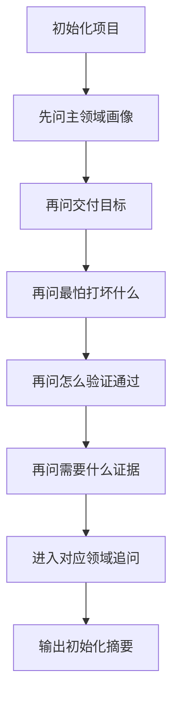

# 项目初始化访谈卡

> 当用户说“初始化项目”，但还没说清领域、测试方法和证据口径时，用这张卡配合 `/grill-me` 一次问一个问题。



## 1. 通用 5 问

按顺序问，能回答就继续，答不清再追问。

1. 这个项目最像哪一类：
   - 软件开发
   - 算法
   - UI 优化
   - 深度学习
   - 混合
2. 这次初始化主要想服务什么交付：
   - 日常开发
   - 算法验证
   - UI 重构
   - 实验循环
3. 这次最怕打坏什么：
   - 线上行为
   - 指标口径
   - 界面流程
   - 数据闭环
4. 这次怎样算通过：
   - 命令通过
   - 指标达标
   - 截图对比通过
   - 实验可复现
5. 这次必须留下什么证据：
   - 日志 / 命令输出
   - 指标表 / 对比图
   - before / after 截图
   - 配置 / 曲线 / checkpoint

## 2. 领域追问

### 软件开发

- 这次主改哪个模块或接口
- 最低必须回归哪条路径
- 是否允许改接口签名或配置格式

### 算法

- 这次主指标是什么
- 基线版本是谁
- 真值和样本从哪里来

### UI 优化

- 这次最痛的页面或流程是哪一个
- 交付时需要哪几组截图
- 是否有固定分辨率、主题或工业现场约束

### 深度学习

- 数据集怎么切分
- 训练预算和时间预算是多少
- 是否必须复现到命令和随机种子级别

## 3. 收口输出模板

访谈后，建议压成下面这段摘要，再开始生成模板：

```markdown
## 初始化摘要
- 主画像：
- 次画像：
- 默认入口模板：
- 公开控制面：
- 按需生成的内部件：
- 核心测试方法：
- 必留证据：
- 是否继续用 /grill-me：
```

## 4. 什么时候停止追问

满足下面 4 条就够了，不要为了流程继续问：

- 主画像已经明确
- 默认入口模板已经能选
- 测试方法至少有一条可执行口径
- 证据格式已经能写进 `test-plan.md`
